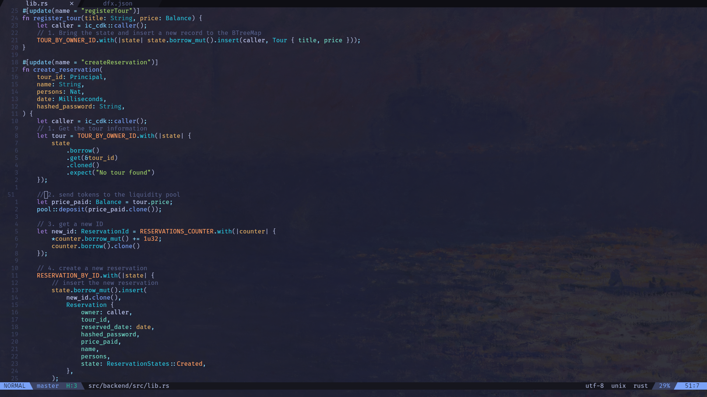
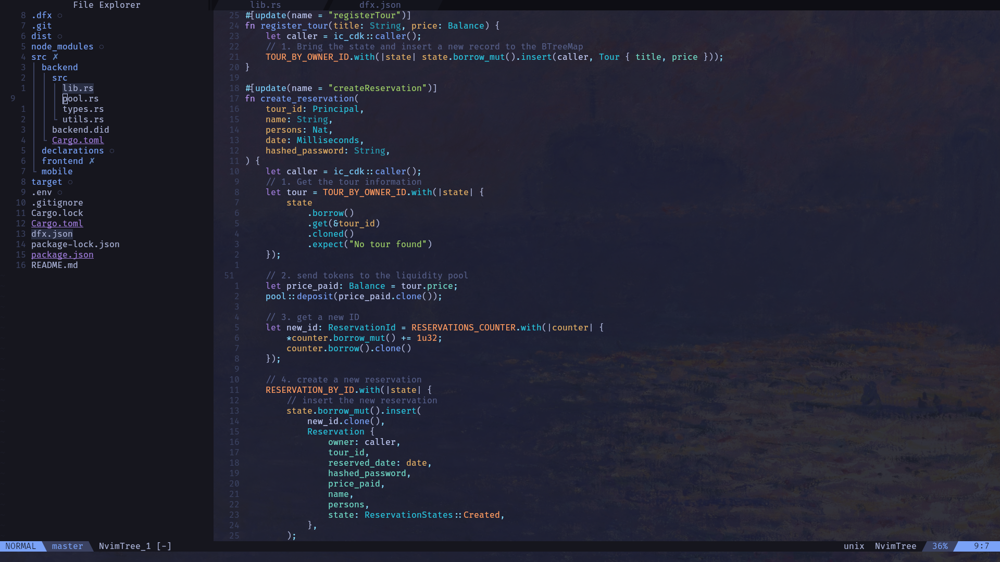
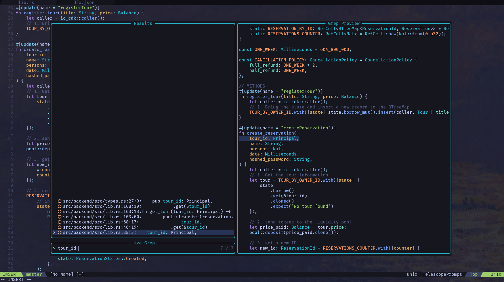
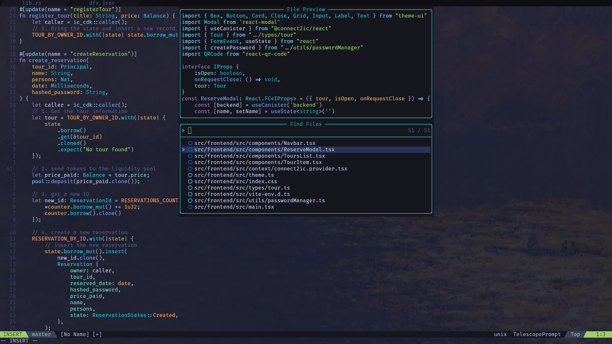

# Nvim rice
## Installation
1. Install [neovim](https://neovim.io)
2. Clone this repository inside ~/.config/
```sh
git clone https://github.com/menuRivera/nvim
```
3. Open nvim
```bash
nvim
```
4. Let everything install
5. Enjoy

## TODO
- [ ] Split buffer keymappings / configuration 
- [ ] DAP configs
- [ ] Migrate to [blink.cmp?](https://github.com/Saghen/blink.cmp)
- [x] Migrate to [lazy.nvim](https://github.com/folke/lazy.nvim)
- [x] LSP 
- [x] GitSigns
- [x] Toggle comments
- [x] Telescope
- [x] Formatting 
- [x] Autocompletion

## Screenshots




